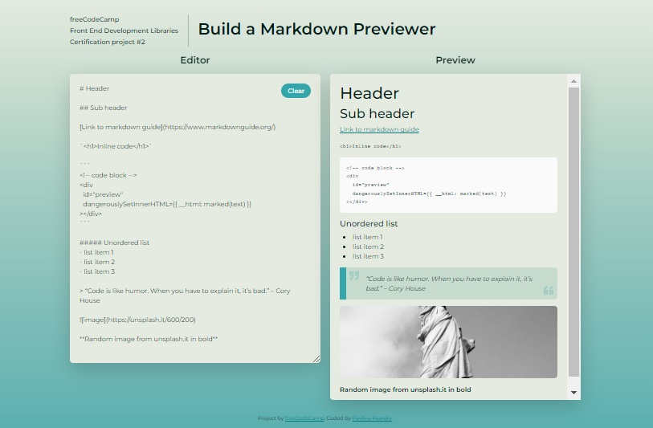

## freeCodeCamp - Front End Development Libraries Project

# Build a Markdown Previewer

This is a solution to the [Build a Markdown Previewer](https://www.freecodecamp.org/learn/front-end-development-libraries/front-end-development-libraries-projects/build-a-markdown-previewer), the second of 5 projects to earn the Front End Development Libraries certification. FreeCodeCamp's mission is to help people learn to code for free.

## Table of contents

- [Overview](#overview)
  - [The challenge](#the-challenge)
  - [Screenshot](#screenshot)
  - [Links](#links)
- [My process](#my-process)
  - [Built with](#built-with)
  - [What I learned](#what-i-learned)
  - [Continued development](#continued-development)
  - [Useful resources](#useful-resources)
- [Author](#author)
- [Acknowledgments](#acknowledgments)

## Overview

### The challenge

Fulfill the user stories and get all of the tests to pass. You can use any mix of HTML, JavaScript, CSS, Bootstrap, SASS, React, Redux, and jQuery to complete this project.

### Screenshot

| Desktop layout |
| :------------: |



| Mobile layout |
| :-----------: |


### Links

- Solution URL: https://github.com/PavlinaPs/markdown-previewer
- Live Site URL: https://pavlinaps.github.io/markdown-previewer/

## My process

### Built with

- [React](https://reactjs.org/) - JS library
- [Bootstrap](https://getbootstrap.com/)
- mobile first approach

### What I learned

This project may be too small to use React.js, but for me it was great to practice the create-react-app, bootstrap and additional css set-up.

Maybe I shouldn't have used Bootstrap, because I had to do a lot of workarounds and use _!important_ flag a lot of times (which I don't like), but Bootstrap plays a nice role in responsiveness of the project.

I learned a lot again, all the links are below. I learned how to parse markdown:

```js
dangerouslySetInnerHTML={{ __html: marked(text) }}
```

### Continued development

I need to improve in React.js alone and in combination with Bootstrap & Sass customizations or Tailwind and code more complicated projects.

### Useful resources

- [create-react-app and Sass](https://create-react-app.dev/docs/adding-a-sass-stylesheet) - set up documentation
- [Marked npm](https://www.npmjs.com/package/marked) - Top-level compiler for parsing markdown
- [Marked Documentation](https://marked.js.org/) - marked documentation
- [React.js: Set innerHTML vs dangerouslySetInnerHTML](https://stackoverflow.com/questions/37337289/react-js-set-innerhtml-vs-dangerouslysetinnerhtml) - on Stack Overflow
- [How to Build a Markdown Previewer with React.js](https://www.freecodecamp.org/news/how-to-build-a-markdown-previewer-with-react-js/) - the part how to include Bootstrap in React.js
- [How to use SVG with :before or :after pseudo element?](https://www.geeksforgeeks.org/how-to-use-svg-with-before-or-after-pseudo-element/)
- [About rel=noopener](https://mathiasbynens.github.io/rel-noopener/#recommendations) with target="\_blank"
- [How to Add White Space Between Elements in React JSX](https://techstacker.com/how-to-add-white-space-between-elements-react-jsx/)

## Author

- Website - [My portfolio](https://pavlinaps.github.io/my-portfolio/)
- freeCodeCamp - [@pavlina1](https://www.freecodecamp.org/pavlina1)
- Frontend Mentor - [@PavlinaPs](https://www.frontendmentor.io/profile/PavlinaPs)
- Twitter - [@PPsarsky](https://www.twitter.com/PPsarsky)

## Acknowledgments

It is great that I can learn to code with freeCodeCamp. I really appreciate what they are doing for the coding community. The projects are all very useful for me. All of them. Thank you!
